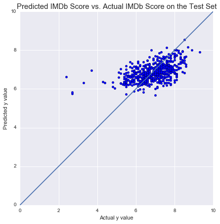

# IMDb-Regression

This project aims to predict the average user rating for movies on [IMDb.com](http://imdb.com). Feature engineering was done using some domain knowledge of which actors and directors are (in)famously good or bad. An XGBoost model was used with linear regression as a comparison. 

The presentation can be found [here.](Predicting%20IMDb%20User%20Rating.pdf)  
A blog post for this project can be found [here.](https://kevinkdu.wordpress.com/2016/11/09/metis-project-2/)
